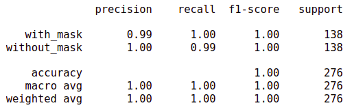
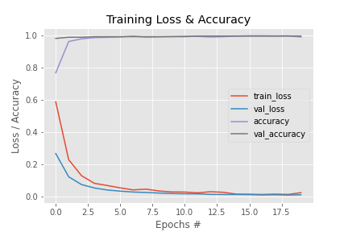

# Detection-of-Face-Mask

## Background - One of the tasks for Computer Vision internship at [The Sparks Foundation](https://internship.thesparksfoundation.info/).
### Face Mask Detection project by classification of `with_mask` & `without_mask` classes is using TensorFlow, Keras and transfer learning with MobileNetV2 DNN architecture having weights of pre-trained on the `imagenet`. Training for the model and the dataset of this project is done on free GPU of GoogleColab notebook. 

## Algorithm
Phase:1 - Train Face Mask Detector
  1. Load Face Mask Dataset
  2. Train Face Mask Classifier with Keras/TensorFlow and using Transfer Learning with MobileNetV2 as baseModel
  3. Serialize trained face mask classification model to disk

Phase:2 - Apply Face Mask Detector
  1. Load face mask classification model from disk
  2. Detect faces in image/videostream 
  3. Extract each face ROI
  4. Apply face mask classifier to each face ROI to determine "mask" or "no mask"
  5. Save/Show the result
  
## Requirements
Check the package manager, [conda](https://docs.conda.io/projects/conda/en/latest/index.html) which will be required to install required libraries & packages under specific virtual environment.
Install anaconda on your machine, and run the following cell on terminal/command prompt after installed.
```
conda create -n FaceMaskDetector jupyter tensorflow keras python opencv imutils scipy numpy pandas matplotlib
```
## Model Architecture
`MobileNetV2 BaseModel` -> `Average Pooling` -> `Flatten` -> `Dense` -> `Dropout` -> `Dense`
* Transfer Learning with `MobileNetV2` with weights of pretrained on `imagenet`
* Average Pooling with `pool_size=(7, 7)`
* `flatten` into vector
* Dense layer with `units=128` and `activation='relu'`
* Dropout 50%/`0.5` of neurons
* Final Dense layer with `units=2` and `activation='softmax'`

## Classification Report & Train Accuracy & Loss Evaluation
      

## Demo 


## References

https://towardsdatascience.com/my-quarantine-project-a-real-time-face-mask-detector-using-tensorflow-3e7c61a42c40

https://pyimagesearch.com/2020/05/04/covid-19-face-mask-detector-with-opencv-keras-tensorflow-and-deep-learning/
